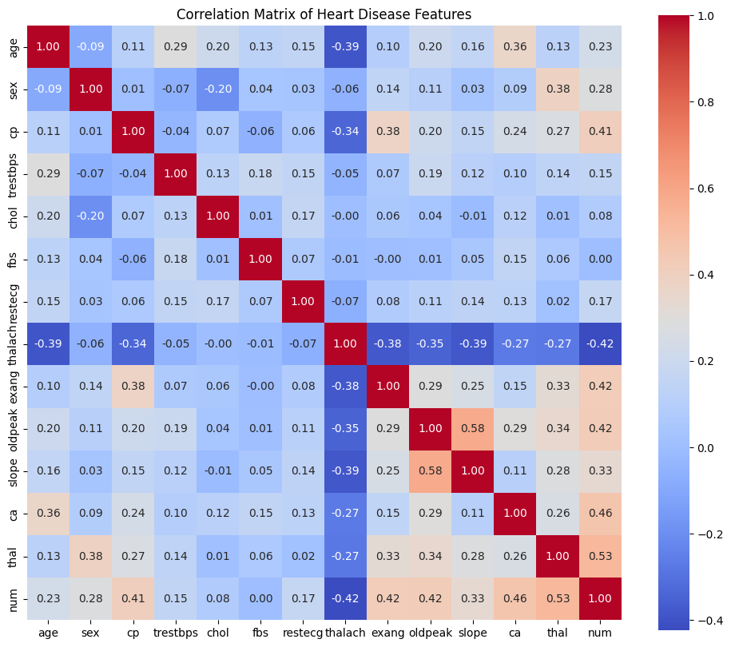
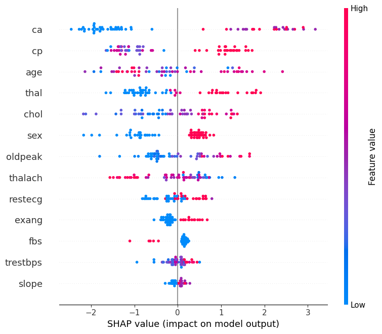

# Interpretable Machine Learning for Heart Disease Prediction

This repository contains the research and implementation of an interpretable machine learning framework to predict heart disease using the **UCI Heart Disease dataset**.

## 📑 Project Overview
Heart disease remains a leading cause of global mortality. This study evaluates the predictive power and clinical interpretability of three models: **Logistic Regression**, **Random Forest**, and **XGBoost**.

### 🔑 Key Findings
*   **Top Model**: XGBoost achieved the highest performance with a **ROC-AUC of 0.95**.

*   **Predictive Features**: SHAP (SHapley Additive exPlanations) and Gini importance identified **chest pain type (cp)**, **maximum heart rate (thalach)**, and **number of major vessels (ca)** as the most critical predictors.

*   **Clinical Goal**: Developing transparent decision-support tools for cardiovascular care.

## 🛠️ Methodology
1. **Preprocessing**: Min-Max normalization and handling missing values.
2. **Exploratory Data Analysis (EDA)**: Correlation heatmaps and boxplots were used to identify discriminatory clinical features.
3. **Interpretability**: Used **SHAP values** to provide both global and local explanations for model predictions.

## 👥 Authors
* **J.D.T. Jayawickrama** - General Sir John Kotelawala Defence University
* **H.K.T. Uthsarani** - General Sir John Kotelawala Defence University
* **M. Shainiya** - General Sir John Kotelawala Defence University
* **Udaya Dampage** - General Sir John Kotelawala Defence University
